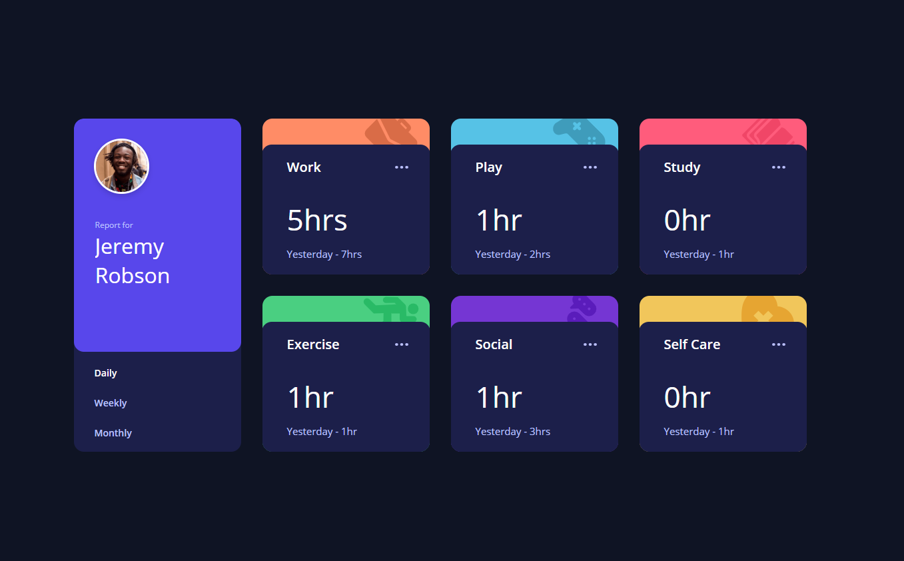
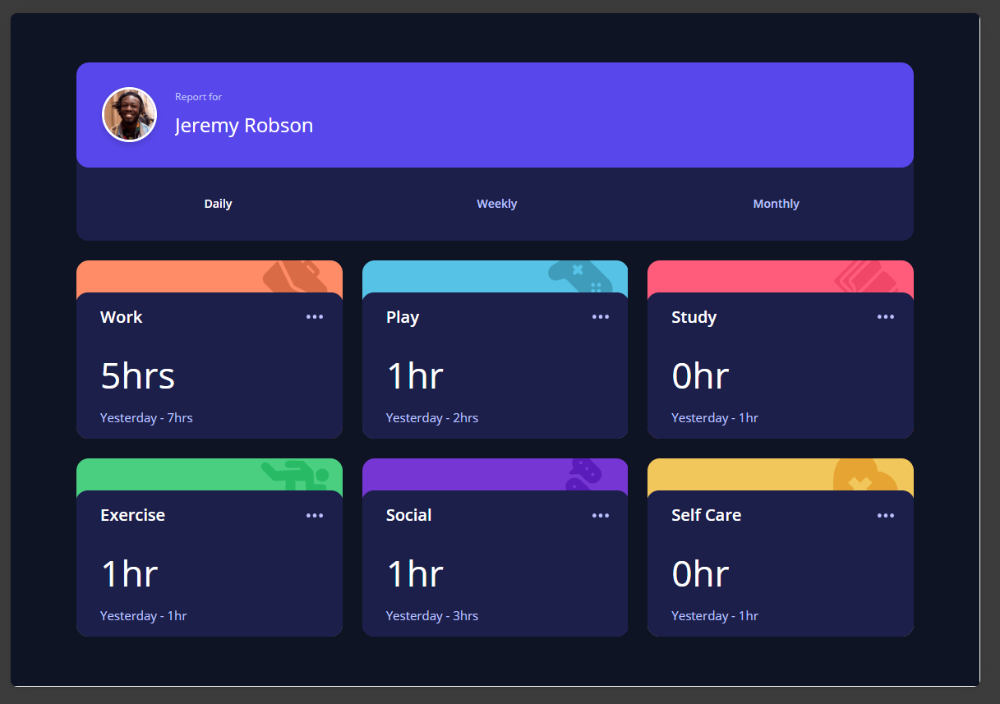
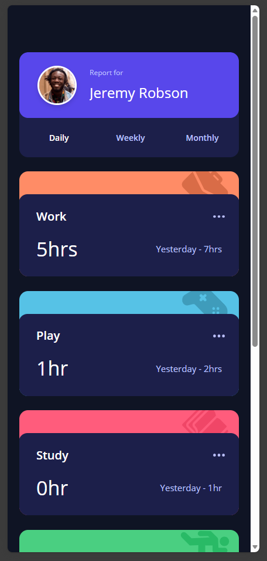

# Frontend Mentor Challenge – Time Tracking Dashboard
Power Apps Canvas application for a time tracking dashboard that allows users to switch between daily, weekly, and monthly statistics, and provides a responsive layout optimized for different screen sizes.

## 🚀 Getting Started

This repository contains the Power Apps Canvas application exported as an `.msapp` file.

### Import the app

1. Go to https://make.powerapps.com
2. Select your **environment**.
3. Open **Apps** from the left navigation.
4. Click **Import canvas app**.
5. Upload the `.msapp` file from this repository.
6. The application will open in **Power Apps Studio**.

After importing, review the app and publish it if needed.

## 🧩 Technologies Used

- Power Apps Canvas (with new grid container control)
- Microsoft Power Platform
- Responsive layout techniques
- UI logic implemented with Power Fx

---

## 🖼 Screenshots

| Desktop Design | Tablet Design | Phone Design |
|---------------|--------------|--------------|
|  |  |  |

## 📊 Features
- Switch between daily, weekly, and monthly stats  
- Responsive layout for different screen sizes
  
---

## 🎯 Challenge Source

This project is based on a challenge from Frontend Mentor.  
Frontend Mentor provides real-world front-end challenges that help developers improve their coding and UI skills.

https://www.frontendmentor.io/

---

## ⚠️ Notes

Depending on your environment, you may need to reconfigure data sources or connections after importing the app.

---

## 👨‍💻 Author

Created as part of my learning process and experimentation with building front-end style applications using Power Apps Canvas.

---
